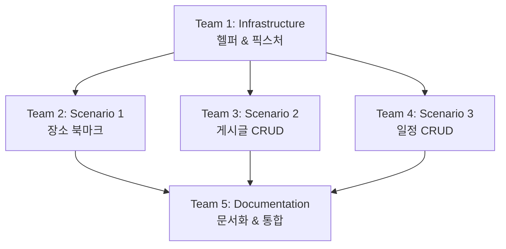

# Work Order: E2E 테스트 구현

**발행일**: 2025-11-19
**담당 PO**: QA Team Lead
**우선순위**: P1 (높음)
**예상 시간**: 4-6시간
**목표**: 핵심 User Journey E2E 테스트 구현

---

## 📋 작업 개요

Playwright를 사용하여 3가지 핵심 사용자 시나리오에 대한 E2E 테스트를 작성합니다.
이 테스트들은 CI/CD 파이프라인에서 자동으로 실행되어 회귀 버그를 방지합니다.

### 현재 상태
- ✅ Playwright 설치 완료 (package.json 확인)
- ✅ 테스트 스크립트 설정 완료
- ❌ 실제 테스트 코드 없음
- ❌ 테스트 헬퍼/유틸리티 없음

### 목표 상태
- ✅ 3개 핵심 시나리오 테스트 완료
- ✅ 테스트 헬퍼/픽스처 구현
- ✅ CI/CD 통합 준비 완료
- ✅ 테스트 문서화 완료

---

## 👥 팀별 작업 지시

---

## **Team 1: Test Infrastructure Team** 🏗️

**담당자**: Test Setup Specialist
**작업 시간**: 1시간
**우선순위**: 최우선 (다른 팀의 블로커)

### 작업 내용

#### 1. 프로젝트 구조 확인 및 생성
```bash
tests/
├── e2e/
│   ├── fixtures/          # 테스트 픽스처
│   ├── helpers/           # 테스트 헬퍼 함수
│   ├── user-journeys/     # User Journey 테스트
│   └── pages/             # Page Object Models (선택사항)
└── test-data/             # 테스트 데이터
```

#### 2. 테스트 헬퍼 함수 구현

**파일**: `tests/e2e/helpers/auth.helper.ts`
```typescript
import { Page } from '@playwright/test';

export class AuthHelper {
  constructor(private page: Page) {}

  async login(email: string, password: string) {
    await this.page.goto('/login');
    await this.page.fill('input[type="email"]', email);
    await this.page.fill('input[type="password"]', password);
    await this.page.click('button[type="submit"]');

    // 로그인 성공 대기
    await this.page.waitForURL('/');
  }

  async logout() {
    // 헤더의 로그아웃 버튼 클릭
    await this.page.click('[data-testid="logout-button"]');
    await this.page.waitForURL('/login');
  }

  async isLoggedIn(): Promise<boolean> {
    // 로그인 상태 확인 로직
    return await this.page.isVisible('[data-testid="user-menu"]');
  }
}
```

**파일**: `tests/e2e/helpers/navigation.helper.ts`
```typescript
import { Page } from '@playwright/test';

export class NavigationHelper {
  constructor(private page: Page) {}

  async goToPlaces() {
    await this.page.click('a[href*="/places"]');
    await this.page.waitForURL(/\/places/);
  }

  async goToBoards() {
    await this.page.click('a[href*="/boards"]');
    await this.page.waitForURL(/\/boards/);
  }

  async goToItinerary() {
    await this.page.click('a[href*="/itinerary"]');
    await this.page.waitForURL(/\/itinerary/);
  }

  async goToMyPage() {
    await this.page.click('a[href*="/mypage"]');
    await this.page.waitForURL(/\/mypage/);
  }
}
```

#### 3. 테스트 픽스처 구현

**파일**: `tests/e2e/fixtures/base.fixture.ts`
```typescript
import { test as base } from '@playwright/test';
import { AuthHelper } from '../helpers/auth.helper';
import { NavigationHelper } from '../helpers/navigation.helper';

type TestFixtures = {
  authHelper: AuthHelper;
  navHelper: NavigationHelper;
  authenticatedPage: any;
};

export const test = base.extend<TestFixtures>({
  authHelper: async ({ page }, use) => {
    const authHelper = new AuthHelper(page);
    await use(authHelper);
  },

  navHelper: async ({ page }, use) => {
    const navHelper = new NavigationHelper(page);
    await use(navHelper);
  },

  authenticatedPage: async ({ page, authHelper }, use) => {
    // 테스트 시작 전 자동 로그인
    await authHelper.login(
      process.env.TEST_USER_EMAIL || 'test@example.com',
      process.env.TEST_USER_PASSWORD || 'password123'
    );
    await use(page);
    // 테스트 종료 후 로그아웃
    await authHelper.logout();
  },
});

export { expect } from '@playwright/test';
```

#### 4. 테스트 데이터 준비

**파일**: `tests/test-data/users.ts`
```typescript
export const testUsers = {
  validUser: {
    email: 'test@example.com',
    password: 'password123',
    name: '테스트유저',
  },
  invalidUser: {
    email: 'invalid@example.com',
    password: 'wrongpassword',
  },
};
```

**파일**: `tests/test-data/places.ts`
```typescript
export const testPlaces = {
  searchKeyword: '서울',
  expectedPlace: '경복궁',
};
```

#### 5. Playwright 설정 확인

**파일**: `playwright.config.ts` (확인 및 필요시 수정)
```typescript
import { defineConfig, devices } from '@playwright/test';

export default defineConfig({
  testDir: './tests/e2e',
  fullyParallel: true,
  forbidOnly: !!process.env.CI,
  retries: process.env.CI ? 2 : 0,
  workers: process.env.CI ? 1 : undefined,
  reporter: 'html',

  use: {
    baseURL: process.env.BASE_URL || 'http://localhost:3000',
    trace: 'on-first-retry',
    screenshot: 'only-on-failure',
  },

  projects: [
    {
      name: 'chromium',
      use: { ...devices['Desktop Chrome'] },
    },
  ],

  webServer: {
    command: 'npm run dev',
    url: 'http://localhost:3000',
    reuseExistingServer: !process.env.CI,
  },
});
```

### 완료 기준
- [ ] 테스트 디렉토리 구조 생성
- [ ] AuthHelper, NavigationHelper 구현
- [ ] 테스트 픽스처 구현
- [ ] 테스트 데이터 준비
- [ ] Playwright 설정 확인

---

## **Team 2: Journey Test Team - Scenario 1** 🔍

**담당자**: QA Engineer 1
**작업 시간**: 1-2시간
**선행 조건**: Team 1 완료 후 시작

### 작업 내용

#### Scenario 1: 로그인 → 장소 검색 → 북마크

**파일**: `tests/e2e/user-journeys/01-place-bookmark.spec.ts`

```typescript
import { test, expect } from '../fixtures/base.fixture';
import { testPlaces } from '../../test-data/places';

test.describe('User Journey: 장소 검색 및 북마크', () => {
  test('사용자가 로그인하여 장소를 검색하고 북마크할 수 있다', async ({
    page,
    authHelper,
    navHelper
  }) => {
    // 1. 로그인
    test.step('로그인', async () => {
      await authHelper.login('test@example.com', 'password123');
      await expect(page).toHaveURL('/');

      // 로그인 성공 확인
      const isLoggedIn = await authHelper.isLoggedIn();
      expect(isLoggedIn).toBeTruthy();
    });

    // 2. 장소 페이지로 이동
    test.step('장소 페이지로 이동', async () => {
      await navHelper.goToPlaces();
      await expect(page).toHaveURL(/\/places/);
    });

    // 3. 장소 검색
    test.step('장소 검색', async () => {
      // 검색 입력
      const searchInput = page.locator('input[placeholder*="검색"]');
      await searchInput.fill(testPlaces.searchKeyword);

      // 검색 결과 대기
      await page.waitForSelector('[data-testid="place-card"]', {
        timeout: 10000
      });

      // 검색 결과 확인
      const placeCards = page.locator('[data-testid="place-card"]');
      const count = await placeCards.count();
      expect(count).toBeGreaterThan(0);
    });

    // 4. 첫 번째 장소 클릭하여 상세 페이지 이동
    test.step('장소 상세 페이지 이동', async () => {
      const firstPlace = page.locator('[data-testid="place-card"]').first();
      await firstPlace.click();

      await page.waitForURL(/\/places\/[^/]+$/);

      // 상세 페이지 로딩 확인
      await expect(page.locator('h1')).toBeVisible();
    });

    // 5. 북마크 추가
    test.step('북마크 추가', async () => {
      const bookmarkButton = page.locator('button:has-text("북마크")');

      // 북마크 버튼 클릭
      await bookmarkButton.click();

      // 성공 토스트 확인
      await expect(page.locator('text=/북마크.*추가/i')).toBeVisible({
        timeout: 5000
      });

      // 북마크 버튼 상태 변경 확인
      await expect(bookmarkButton).toHaveAttribute('aria-pressed', 'true');
    });

    // 6. 마이페이지에서 북마크 확인
    test.step('마이페이지에서 북마크 확인', async () => {
      await navHelper.goToMyPage();

      // 북마크 탭 클릭
      await page.click('text=북마크');
      await page.waitForURL(/\/mypage\/bookmarks/);

      // 북마크한 장소 확인
      const bookmarkedPlaces = page.locator('[data-testid="bookmarked-place"]');
      const count = await bookmarkedPlaces.count();
      expect(count).toBeGreaterThan(0);
    });

    // 7. 북마크 제거
    test.step('북마크 제거', async () => {
      const removeButton = page.locator('button:has-text("북마크 해제")').first();
      await removeButton.click();

      // 확인 다이얼로그 처리
      page.on('dialog', dialog => dialog.accept());

      // 성공 토스트 확인
      await expect(page.locator('text=/북마크.*해제/i')).toBeVisible();
    });
  });

  test('북마크는 로그인 없이 사용할 수 없다', async ({ page, navHelper }) => {
    // 비로그인 상태에서 장소 페이지 방문
    await page.goto('/places');

    // 첫 번째 장소 클릭
    const firstPlace = page.locator('[data-testid="place-card"]').first();
    await firstPlace.click();

    // 북마크 버튼 클릭
    const bookmarkButton = page.locator('button:has-text("북마크")');
    await bookmarkButton.click();

    // 로그인 필요 메시지 확인
    await expect(page.locator('text=/로그인.*필요/i')).toBeVisible();
  });
});
```

### 완료 기준
- [ ] 로그인 → 검색 → 북마크 플로우 테스트 작성
- [ ] 비로그인 상태 테스트 작성
- [ ] 모든 단계별 assertion 포함
- [ ] 테스트 실행 성공

---

## **Team 3: Journey Test Team - Scenario 2** 📝

**담당자**: QA Engineer 2
**작업 시간**: 1-2시간
**선행 조건**: Team 1 완료 후 시작

### 작업 내용

#### Scenario 2: 게시글 작성 → 수정 → 삭제

**파일**: `tests/e2e/user-journeys/02-board-crud.spec.ts`

```typescript
import { test, expect } from '../fixtures/base.fixture';

test.describe('User Journey: 게시글 CRUD', () => {
  const testBoard = {
    title: `E2E 테스트 게시글 ${Date.now()}`,
    content: '이것은 자동화 테스트로 작성된 게시글입니다.',
    updatedTitle: `E2E 테스트 게시글 (수정됨) ${Date.now()}`,
    updatedContent: '게시글 내용이 수정되었습니다.',
  };

  test('사용자가 게시글을 작성, 수정, 삭제할 수 있다', async ({
    page,
    authenticatedPage,
    navHelper,
  }) => {
    // 1. 게시판 페이지로 이동
    test.step('게시판 페이지로 이동', async () => {
      await navHelper.goToBoards();
      await expect(page).toHaveURL(/\/boards/);
    });

    // 2. 새 글 작성 버튼 클릭
    test.step('글쓰기 페이지로 이동', async () => {
      await page.click('button:has-text("새 글"), a:has-text("글쓰기")');
      await page.waitForURL(/\/boards\/new/);
    });

    // 3. 게시글 작성
    test.step('게시글 작성', async () => {
      // 카테고리 선택
      await page.selectOption('select[name="category"]', 'COMMUNITY');

      // 제목 입력
      await page.fill('input[name="title"]', testBoard.title);

      // 내용 입력 (TipTap 에디터)
      const editor = page.locator('.ProseMirror');
      await editor.click();
      await editor.fill(testBoard.content);

      // 작성 버튼 클릭
      await page.click('button:has-text("작성")');

      // 상세 페이지로 이동 대기
      await page.waitForURL(/\/boards\/[^/]+$/);

      // 작성한 게시글 내용 확인
      await expect(page.locator('h1')).toContainText(testBoard.title);
      await expect(page.locator('article, .content')).toContainText(testBoard.content);
    });

    // 4. 게시글 수정
    test.step('게시글 수정', async () => {
      // 수정 버튼 클릭
      await page.click('button:has-text("수정")');
      await page.waitForURL(/\/boards\/[^/]+\/edit/);

      // 제목 수정
      const titleInput = page.locator('input[name="title"]');
      await titleInput.clear();
      await titleInput.fill(testBoard.updatedTitle);

      // 내용 수정
      const editor = page.locator('.ProseMirror');
      await editor.click();
      await page.keyboard.press('Control+A'); // 전체 선택
      await editor.fill(testBoard.updatedContent);

      // 저장 버튼 클릭
      await page.click('button:has-text("저장"), button:has-text("수정")');

      // 상세 페이지로 돌아오기
      await page.waitForURL(/\/boards\/[^/]+$/);

      // 수정된 내용 확인
      await expect(page.locator('h1')).toContainText(testBoard.updatedTitle);
      await expect(page.locator('article, .content')).toContainText(testBoard.updatedContent);
    });

    // 5. 게시글 삭제
    test.step('게시글 삭제', async () => {
      // 삭제 버튼 클릭
      await page.click('button:has-text("삭제")');

      // 확인 다이얼로그 처리
      page.on('dialog', dialog => dialog.accept());

      // 목록 페이지로 이동
      await page.waitForURL(/\/boards$/);

      // 삭제 성공 메시지 확인
      await expect(page.locator('text=/삭제.*성공/i')).toBeVisible();
    });

    // 6. 삭제 확인 (목록에서 없어졌는지)
    test.step('삭제 확인', async () => {
      // 삭제한 게시글이 목록에 없는지 확인
      const deletedPost = page.locator(`text="${testBoard.updatedTitle}"`);
      await expect(deletedPost).not.toBeVisible();
    });
  });

  test('비로그인 사용자는 게시글을 작성할 수 없다', async ({ page }) => {
    // 비로그인 상태에서 글쓰기 페이지 접근 시도
    await page.goto('/boards/new');

    // 로그인 페이지로 리다이렉트 확인
    await expect(page).toHaveURL(/\/login/);
  });

  test('다른 사용자의 게시글은 수정/삭제할 수 없다', async ({
    page,
    authenticatedPage,
  }) => {
    // 다른 사용자의 게시글로 이동 (fixture로 특정 게시글 ID 제공)
    await page.goto('/boards/other-user-post-id'); // 실제 ID로 교체 필요

    // 수정/삭제 버튼이 보이지 않는지 확인
    await expect(page.locator('button:has-text("수정")')).not.toBeVisible();
    await expect(page.locator('button:has-text("삭제")')).not.toBeVisible();
  });
});
```

### 완료 기준
- [ ] 게시글 CRUD 전체 플로우 테스트 작성
- [ ] 권한 검증 테스트 작성
- [ ] TipTap 에디터 상호작용 처리
- [ ] 테스트 실행 성공

---

## **Team 4: Journey Test Team - Scenario 3** 🗓️

**담당자**: QA Engineer 3
**작업 시간**: 1-2시간
**선행 조건**: Team 1 완료 후 시작

### 작업 내용

#### Scenario 3: 일정 생성 → 수정 → 삭제

**파일**: `tests/e2e/user-journeys/03-itinerary-crud.spec.ts`

```typescript
import { test, expect } from '../fixtures/base.fixture';

test.describe('User Journey: 일정 CRUD', () => {
  const testItinerary = {
    title: `E2E 테스트 여행 ${Date.now()}`,
    region: '서울',
    startDate: '2025-12-01',
    endDate: '2025-12-03',
    updatedTitle: `E2E 테스트 여행 (수정됨) ${Date.now()}`,
  };

  test('사용자가 여행 일정을 생성, 수정, 삭제할 수 있다', async ({
    page,
    authenticatedPage,
    navHelper,
  }) => {
    // 1. 일정 페이지로 이동
    test.step('일정 페이지로 이동', async () => {
      await navHelper.goToItinerary();
      await expect(page).toHaveURL(/\/itinerary/);
    });

    // 2. 새 일정 만들기
    test.step('일정 생성 페이지로 이동', async () => {
      await page.click('button:has-text("새 일정"), a:has-text("일정 만들기")');
      await page.waitForURL(/\/itinerary\/new/);
    });

    // 3. 일정 정보 입력
    test.step('일정 생성', async () => {
      // 제목 입력
      await page.fill('input[name="title"]', testItinerary.title);

      // 지역 선택
      await page.fill('input[name="region"]', testItinerary.region);

      // 시작 날짜 입력
      await page.fill('input[type="date"][name="startDate"]', testItinerary.startDate);

      // 종료 날짜 입력
      await page.fill('input[type="date"][name="endDate"]', testItinerary.endDate);

      // 생성 버튼 클릭
      await page.click('button:has-text("생성"), button[type="submit"]');

      // 상세 페이지로 이동 대기
      await page.waitForURL(/\/itinerary\/[^/]+$/);

      // 생성된 일정 확인
      await expect(page.locator('h1')).toContainText(testItinerary.title);
      await expect(page.locator('text=/서울/i')).toBeVisible();
    });

    // 4. 일정 수정
    test.step('일정 수정', async () => {
      // 수정 버튼 클릭
      await page.click('button:has-text("수정")');
      await page.waitForURL(/\/itinerary\/[^/]+\/edit/);

      // 제목 수정
      const titleInput = page.locator('input[name="title"]');
      await titleInput.clear();
      await titleInput.fill(testItinerary.updatedTitle);

      // 저장 버튼 클릭
      await page.click('button:has-text("저장")');

      // 상세 페이지로 돌아오기
      await page.waitForURL(/\/itinerary\/[^/]+$/);

      // 수정된 제목 확인
      await expect(page.locator('h1')).toContainText(testItinerary.updatedTitle);
    });

    // 5. 일정에 장소 추가 (선택사항, 복잡도에 따라)
    test.step('일정에 장소 추가', async () => {
      // 편집 모드 진입
      await page.click('button:has-text("편집"), button:has-text("수정")');
      await page.waitForURL(/\/itinerary\/[^/]+\/edit/);

      // Day 1 선택
      await page.click('button:has-text("Day 1")');

      // 장소 추가 버튼 클릭 (UI에 따라 조정 필요)
      // 이 부분은 실제 UI 구현에 따라 달라질 수 있음
      await page.click('button:has-text("장소 추가")');

      // 장소 검색/선택 로직
      // ...
    });

    // 6. 일정 삭제
    test.step('일정 삭제', async () => {
      // 상세 페이지로 돌아가기 (편집 모드에서 나오기)
      const currentUrl = page.url();
      if (currentUrl.includes('/edit')) {
        await page.click('button:has-text("취소"), a:has-text("돌아가기")');
        await page.waitForURL(/\/itinerary\/[^/]+$/);
      }

      // 삭제 버튼 클릭
      await page.click('button:has-text("삭제")');

      // 확인 다이얼로그 처리
      page.on('dialog', dialog => dialog.accept());

      // 목록 페이지로 이동
      await page.waitForURL(/\/itinerary$/);

      // 삭제 성공 메시지 확인
      await expect(page.locator('text=/삭제.*성공/i')).toBeVisible();
    });

    // 7. 삭제 확인
    test.step('삭제 확인', async () => {
      // 삭제한 일정이 목록에 없는지 확인
      const deletedItinerary = page.locator(`text="${testItinerary.updatedTitle}"`);
      await expect(deletedItinerary).not.toBeVisible();
    });
  });

  test('비로그인 사용자는 일정을 생성할 수 없다', async ({ page }) => {
    // 비로그인 상태에서 일정 생성 페이지 접근 시도
    await page.goto('/itinerary/new');

    // 로그인 페이지로 리다이렉트 확인
    await expect(page).toHaveURL(/\/login/);
  });

  test('날짜 유효성 검증', async ({ page, authenticatedPage }) => {
    // 일정 생성 페이지로 이동
    await page.goto('/itinerary/new');

    // 제목 입력
    await page.fill('input[name="title"]', '테스트 일정');

    // 잘못된 날짜 입력 (종료일이 시작일보다 빠름)
    await page.fill('input[name="startDate"]', '2025-12-10');
    await page.fill('input[name="endDate"]', '2025-12-05');

    // 생성 시도
    await page.click('button[type="submit"]');

    // 에러 메시지 확인
    await expect(page.locator('text=/날짜.*잘못/i, text=/종료.*이후/i')).toBeVisible();
  });
});
```

### 완료 기준
- [ ] 일정 CRUD 전체 플로우 테스트 작성
- [ ] 날짜 유효성 검증 테스트 작성
- [ ] 권한 검증 테스트 작성
- [ ] 테스트 실행 성공

---

## **Team 5: Documentation & Integration Team** 📚

**담당자**: QA Documentation Specialist
**작업 시간**: 1시간
**선행 조건**: Team 2, 3, 4 완료 후 시작

### 작업 내용

#### 1. 테스트 실행 가이드 작성

**파일**: `tests/E2E_TEST_GUIDE.md`

```markdown
# E2E 테스트 가이드

## 사전 준비

### 1. 테스트 사용자 계정 준비
```bash
# .env.test 파일 생성
TEST_USER_EMAIL=test@example.com
TEST_USER_PASSWORD=password123
```

### 2. Playwright 브라우저 설치
```bash
npx playwright install
```

## 테스트 실행

### 전체 테스트 실행
```bash
npm run test:e2e
```

### 특정 시나리오만 실행
```bash
# Scenario 1: 장소 북마크
npx playwright test 01-place-bookmark

# Scenario 2: 게시글 CRUD
npx playwright test 02-board-crud

# Scenario 3: 일정 CRUD
npx playwright test 03-itinerary-crud
```

### UI 모드로 실행 (디버깅)
```bash
npm run test:e2e:ui
```

### 특정 브라우저로 실행
```bash
npm run test:e2e:chromium
npm run test:e2e:firefox
npm run test:e2e:webkit
```

## 테스트 결과 확인

### HTML 리포트 보기
```bash
npm run test:e2e:report
```

## 트러블슈팅

### 타임아웃 에러
- `playwright.config.ts`에서 timeout 설정 증가
- 네트워크 속도 확인

### 엘리먼트를 찾을 수 없음
- 실제 UI에 data-testid 속성 추가 필요
- 셀렉터 업데이트

### 인증 실패
- 테스트 계정 확인
- .env.test 파일 확인
```

#### 2. 테스트 실행 스크립트 추가 확인

**파일**: `package.json` (확인 및 추가)
```json
{
  "scripts": {
    "test:e2e": "playwright test",
    "test:e2e:ui": "playwright test --ui",
    "test:e2e:headed": "playwright test --headed",
    "test:e2e:debug": "playwright test --debug",
    "test:e2e:report": "playwright show-report"
  }
}
```

#### 3. CI/CD 통합 준비

**파일**: `.github/workflows/e2e-tests.yml` (선택사항)
```yaml
name: E2E Tests

on:
  push:
    branches: [main, develop]
  pull_request:
    branches: [main, develop]

jobs:
  test:
    runs-on: ubuntu-latest
    steps:
      - uses: actions/checkout@v3

      - uses: actions/setup-node@v3
        with:
          node-version: '18'

      - name: Install dependencies
        run: npm ci

      - name: Install Playwright browsers
        run: npx playwright install --with-deps

      - name: Run E2E tests
        run: npm run test:e2e
        env:
          TEST_USER_EMAIL: ${{ secrets.TEST_USER_EMAIL }}
          TEST_USER_PASSWORD: ${{ secrets.TEST_USER_PASSWORD }}

      - name: Upload test results
        if: always()
        uses: actions/upload-artifact@v3
        with:
          name: playwright-report
          path: playwright-report/
```

#### 4. 테스트 완료 보고서 작성

**파일**: `E2E_TEST_COMPLETION_REPORT.md`
```markdown
# E2E 테스트 구현 완료 보고서

## 구현된 테스트 시나리오

### 1. 장소 검색 및 북마크 (01-place-bookmark.spec.ts)
- 로그인 → 장소 검색 → 북마크 추가 → 확인 → 제거
- 비로그인 상태 권한 검증

### 2. 게시글 CRUD (02-board-crud.spec.ts)
- 게시글 작성 → 수정 → 삭제
- 비로그인 상태 권한 검증
- 타인 게시글 수정/삭제 불가 검증

### 3. 일정 CRUD (03-itinerary-crud.spec.ts)
- 일정 생성 → 수정 → 삭제
- 날짜 유효성 검증
- 비로그인 상태 권한 검증

## 테스트 커버리지

- 핵심 User Journey: 3개 ✅
- 권한 검증 테스트: 6개 ✅
- 총 테스트 케이스: 9+개

## 다음 단계

1. data-testid 속성 UI에 추가
2. 테스트 사용자 계정 준비
3. CI/CD 파이프라인 통합
```

### 완료 기준
- [ ] 테스트 가이드 문서 작성
- [ ] package.json 스크립트 확인
- [ ] CI/CD 워크플로우 작성 (선택)
- [ ] 완료 보고서 작성

---

## 📋 작업 순서 요약



### 타임라인
- **Hour 0-1**: Team 1 (Infrastructure)
- **Hour 1-3**: Team 2, 3, 4 (병렬 작업)
- **Hour 3-4**: Team 5 (Documentation)
- **Hour 4-6**: 통합 테스트 및 버그 수정

---

## ⚠️ 중요 사항

### 1. UI에 data-testid 추가 필요
테스트 작성 중 실제 UI에 `data-testid` 속성이 없을 수 있습니다.
발견 시 별도 이슈로 기록하고, 임시로 다른 셀렉터 사용.

**예시**:
```tsx
// UI 컴포넌트에 추가 필요
<div data-testid="place-card">
<button data-testid="bookmark-button">
```

### 2. 테스트 데이터 격리
- 각 테스트는 독립적으로 실행 가능해야 함
- Date.now()를 사용하여 유니크한 데이터 생성
- 테스트 후 cleanup 고려

### 3. 비동기 처리
- `waitForURL`, `waitForSelector` 적극 활용
- timeout 설정 적절히 조정
- 네트워크 요청 완료 대기

### 4. 에러 핸들링
- `test.step()`으로 단계별 구분
- screenshot/trace 자동 저장 활용
- 실패 시 디버깅 정보 충분히 제공

---

## 🎯 완료 기준

### 필수 조건
- [ ] 3개 시나리오 테스트 모두 구현
- [ ] 각 테스트 로컬 실행 성공
- [ ] 테스트 헬퍼 & 픽스처 구현
- [ ] 문서화 완료

### 추가 조건
- [ ] 권한 검증 테스트 포함
- [ ] 에러 케이스 테스트 포함
- [ ] CI/CD 통합 준비 (선택)

---

## 🚀 작업 시작

**Team 1 (Infrastructure Team)**, 테스트 구조 셋업을 시작해주세요!

**명령어**:
```
1. tests/e2e 디렉토리 구조를 생성하고
2. AuthHelper와 NavigationHelper를 구현하고
3. 테스트 픽스처를 설정해줘
```

모든 팀이 준비되면 순차적으로 작업을 진행하겠습니다! 🏁
